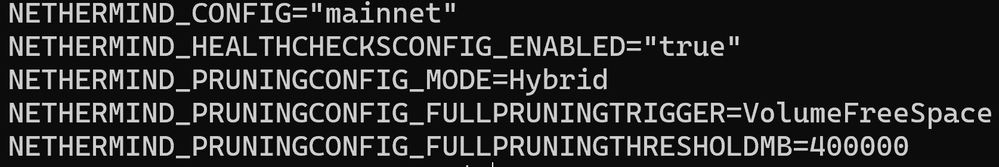
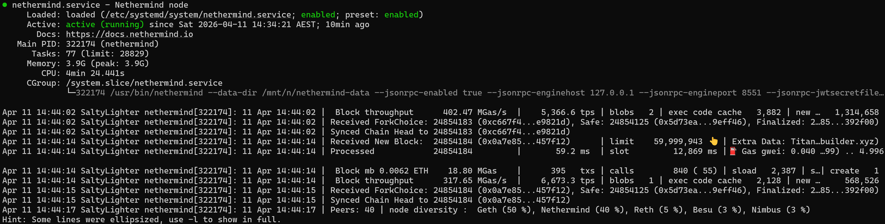
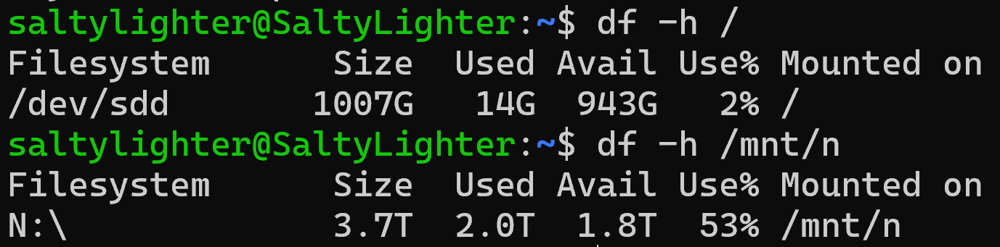

## Nethermind Pruning Setup

Configured Nethermind pruning to better manage long-term database growth on the active data drive at `/mnt/n/nethermind-data`.

### Current pruning settings
- `NETHERMIND_PRUNINGCONFIG_MODE=Hybrid`
- `NETHERMIND_PRUNINGCONFIG_FULLPRUNINGTRIGGER=VolumeFreeSpace`
- `NETHERMIND_PRUNINGCONFIG_FULLPRUNINGTHRESHOLDMB=400000`

### Why I set it this way
- The active Nethermind database is stored on the `N:` drive, which provides much more room than the Linux root filesystem.
- `Hybrid` mode is a practical default for a normal full node.
- `VolumeFreeSpace` allows pruning to trigger automatically based on remaining disk space instead of waiting for a storage incident.
- A threshold of `400000 MB` gives a comfortable safety buffer so pruning can begin before the drive gets too full.

### Active data path
- Nethermind data directory: `/mnt/n/nethermind-data`

### Commands used
    sudo cat /home/nethermind/.env
    sudo systemctl restart nethermind
    sudo systemctl status nethermind --no-pager

### What I learned
- Bigger storage only helps if the service is actually pointed to the correct path.
- `df -h` shows filesystem usage, while `du -sh` shows directory usage.
- Pruning is part of long-term node maintenance, not just a last-minute emergency fix.
