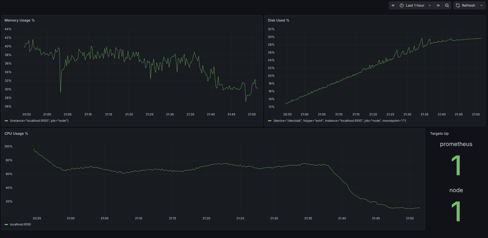

## Basic Grafana Monitoring Dashboard

Built a simple Grafana dashboard using Prometheus as the data source to monitor the node host.

### Panels
- **Targets Up**  
  Uses the `up` metric to confirm Prometheus scrape targets are reachable.
- **CPU Usage %**  
  Shows estimated CPU busy percentage over time.
- **Memory Usage %**  
  Shows percentage of RAM currently in use.
- **Disk Used %**  
  Shows how full the root filesystem is over time.

### Queries Used
- `up`
- `100 * (1 - avg by(instance) (rate(node_cpu_seconds_total{mode="idle"}[5m])))`
- `100 * (1 - (node_memory_MemAvailable_bytes / node_memory_MemTotal_bytes))`
- `100 * (1 - (node_filesystem_avail_bytes{mountpoint="/"} / node_filesystem_size_bytes{mountpoint="/"}))`

### What I Learned
- `up = 1` means Prometheus can successfully scrape the target.
- CPU and memory graphs are more useful when watched as trends over time, not just single spikes.
- `node_filesystem_avail_bytes` going down means free disk space is decreasing.
- Disk used % rising over time is an easy way to spot storage growth from node activity.

### Initial Observations
- Prometheus and node exporter were both up.
- Memory usage stayed relatively stable.
- CPU usage was active but not pinned.
- Disk usage showed a steady upward trend, consistent with ongoing node/sync activity.
