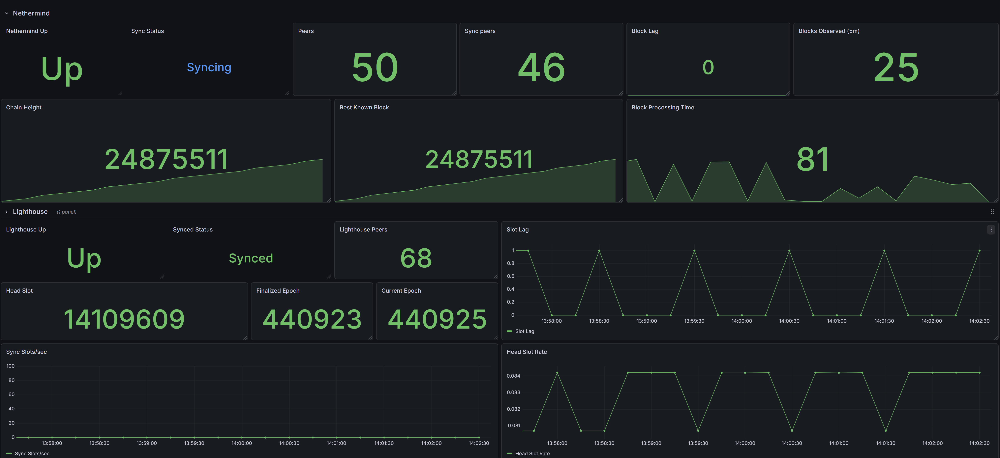
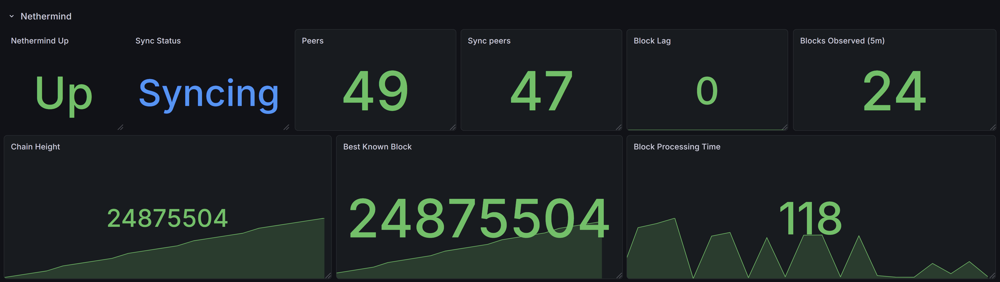
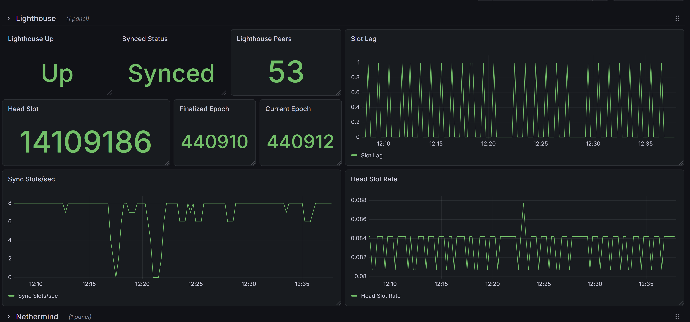
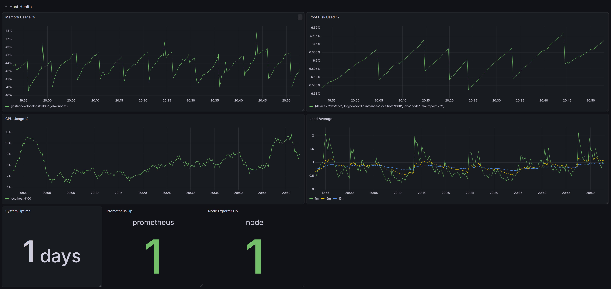
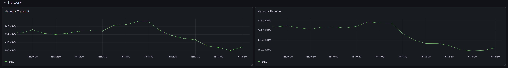
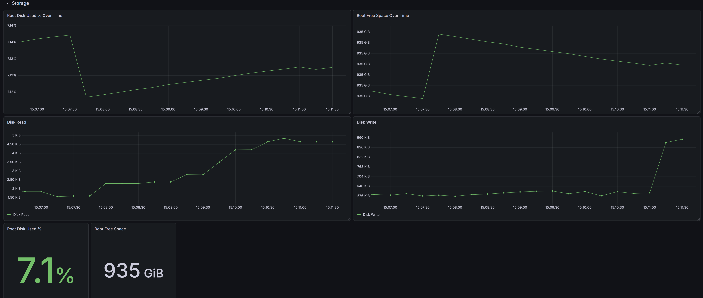

# Grafana Monitoring Dashboard

Built a Grafana dashboard using Prometheus and node_exporter to monitor an Ethereum node stack running on WSL2. What started as a basic system-health view has now grown into a more complete operator dashboard with separate sections for host health, storage, network activity, Lighthouse consensus-client monitoring, and Nethermind execution-client monitoring.

The goal was to move beyond simple “is it running?” checks and build something that helps spot system behaviour, resource pressure, storage trends, disk activity, and Ethereum client sync issues before they become incidents.

---

## Current Dashboard Sections

### Host Health

Tracks core machine health and scrape availability:

- **Memory Usage %**  
  Shows RAM usage over time.

- **CPU Usage %**  
  Shows estimated CPU busy percentage over time.

- **Root Disk Used %**  
  Shows how full the root filesystem is.

- **Load Average**  
  Displays Linux load averages over 1 minute, 5 minutes, and 15 minutes to show short-term and long-term system pressure.

- **System Uptime**  
  Shows how long the host has been running since the last reboot.

- **Prometheus Up**  
  Confirms Prometheus is being scraped successfully.

- **Node Exporter Up**  
  Confirms node_exporter is being scraped successfully.

---

### Network

Tracks host traffic activity:

- **Network Receive**  
  Shows inbound throughput over time.

- **Network Transmit**  
  Shows outbound throughput over time.

---

### Storage

Tracks both current storage state and storage behaviour over time:

- **Root Disk Used % Over Time**  
  Shows root filesystem growth as a percentage.

- **Root Free Space Over Time**  
  Shows available free space on the root filesystem over time.

- **Disk Read**  
  Shows disk read throughput over time for the active block device.

- **Disk Write**  
  Shows disk write throughput over time for the active block device.

- **Root Disk Used %**  
  Quick stat for current root disk usage.

- **Root Free Space**  
  Quick stat for current available root free space.

---

### Lighthouse

Tracks consensus-client health and sync behaviour:

- **Lighthouse Up**  
  Confirms the Lighthouse beacon node metrics target is being scraped successfully.

- **Synced Status**  
  Shows whether Lighthouse reports itself as synced.

- **Lighthouse Peers**  
  Shows the current peer count for the beacon node.

- **Head Slot**  
  Shows the latest beacon-chain head slot known to Lighthouse.

- **Finalized Epoch**  
  Shows the most recently finalized epoch.

- **Current Epoch**  
  Shows the present epoch according to the beacon-chain slot clock.

- **Slot Lag**  
  Shows the difference between the present slot and Lighthouse’s head slot, helping confirm whether the node is keeping up.

- **Sync Slots/sec**  
  Shows how quickly Lighthouse is moving through slots during sync activity.

- **Head Slot Rate**  
  Shows the rate of head-slot progression over time.

---

### Nethermind

Tracks execution-client health, sync state, peer activity, execution progress, and processing behaviour:

- **Nethermind Up**  
  Confirms the Nethermind metrics target is being scraped successfully.

- **Sync Status**  
  Shows whether Nethermind reports itself as still syncing or fully synced.

- **Peers**  
  Shows the current connected peer count.

- **Sync Peers**  
  Shows how many peers are actively helping with sync.

- **Block Lag**  
  Shows the difference between the best known block and the local chain height.

- **Blocks Observed (5m)**  
  Shows the approximate number of blocks observed or processed over the last 5 minutes.

- **Chain Height**  
  Shows the current local blockchain height known to Nethermind.

- **Best Known Block**  
  Shows the best block number currently known to Nethermind from peers/network.

- **Block Processing Time**  
  Shows how long Nethermind took to process the most recent block, in milliseconds.

---

## Key Queries Used

### Prometheus target health

    up{job="prometheus"}

    up{job="node"}

### CPU usage %

    100 * (1 - avg(rate(node_cpu_seconds_total{mode="idle"}[5m])) by (instance))

### Memory usage %

    100 * (1 - (node_memory_MemAvailable_bytes / node_memory_MemTotal_bytes))

### Root disk used %

    100 * (1 - (node_filesystem_avail_bytes{mountpoint="/",fstype="ext4"} / node_filesystem_size_bytes{mountpoint="/",fstype="ext4"}))

### Root free space

    node_filesystem_avail_bytes{mountpoint="/",fstype="ext4"}

### System uptime

    node_time_seconds - node_boot_time_seconds

### Load average

    node_load1

    node_load5

    node_load15

### Network receive

    rate(node_network_receive_bytes_total{device!="lo"}[5m])

### Network transmit

    rate(node_network_transmit_bytes_total{device!="lo"}[5m])

### Disk read throughput

    rate(node_disk_read_bytes_total{device="sdd"}[5m])

### Disk write throughput

    rate(node_disk_written_bytes_total{device="sdd"}[5m])

### Lighthouse up

    up{job="lighthouse"}

### Lighthouse synced status

    sync_eth2_synced{job="lighthouse"}

### Lighthouse peers

    libp2p_peers{job="lighthouse"}

### Lighthouse head slot

    beacon_head_slot{job="lighthouse"}

### Lighthouse finalized epoch

    beacon_finalized_epoch{job="lighthouse"}

### Lighthouse current epoch

    slotclock_present_epoch{job="lighthouse"}

### Lighthouse slot lag

    slotclock_present_slot{job="lighthouse"} - beacon_head_slot{job="lighthouse"}

### Lighthouse sync slots/sec

    sync_slots_per_second{job="lighthouse"}

### Lighthouse head slot rate

    rate(beacon_head_slot{job="lighthouse"}[5m])

### Nethermind up

    up{job="nethermind"}

### Nethermind peers

    sum(ethereum_peer_count)

### Nethermind sync peers

    sum(nethermind_sync_peers)

### Nethermind sync status

    max(nethermind_state_synced)

### Nethermind chain height

    max(ethereum_blockchain_height)

### Nethermind best known block

    max(ethereum_best_known_block_number)

### Nethermind block lag

    max(ethereum_best_known_block_number) - max(ethereum_blockchain_height)

### Nethermind blocks observed (5m)

    increase(nethermind_blocks[5m])

### Nethermind block processing time

    max(nethermind_last_block_processing_time_in_ms)

---

## What I Learned

- `up = 1` means Prometheus can successfully scrape that target.
- Host monitoring becomes much more useful when panels are grouped by purpose instead of mixed together.
- CPU %, memory %, and load average each tell a different story about system pressure.
- Load average is not the same as CPU usage. It shows how much work is running or waiting over different time windows.
- Tracking both current storage values and storage trends over time makes it easier to spot unhealthy growth patterns early.
- `node_filesystem_avail_bytes` is useful for free-space visibility, while used percentage is often easier to read quickly during troubleshooting.
- WSL-mounted Windows drives exposed through `9p` and `drvfs` do not behave as cleanly in node_exporter as native Linux filesystems like `ext4`, so the dashboard was kept focused on the root Linux filesystem for reliable storage monitoring.
- Disk I/O adds an important extra layer for node monitoring because Ethereum clients can appear healthy on CPU while still being bottlenecked by storage behaviour.
- Lighthouse metrics are not always named with a `lighthouse_` prefix, so discovering the real metric names through Prometheus was an important part of building the dashboard.
- `sync_eth2_synced` is a better “am I synced?” signal than trying to infer sync from visual progress alone.
- `slotclock_present_slot - beacon_head_slot` is a simple and useful way to monitor whether Lighthouse is keeping up with the chain head.
- A small slot lag of `0` to `1` is normal during steady-state operation and does not necessarily indicate a problem.
- `rate(beacon_head_slot[5m])` provides a useful heartbeat-style signal to confirm the beacon chain head is still progressing.
- `sync_slots_per_second` behaves more like a sync-speed indicator than a general health indicator, so it is most useful during catch-up or recovery.
- Nethermind metrics often expose multiple series, so `sum()` and `max()` were useful for turning raw metrics into clean operator panels.
- `ethereum_blockchain_height` shows the local chain height, while `ethereum_best_known_block_number` shows the best block known from peers/network.
- `Block Lag = Best Known Block - Chain Height` is a simple execution-client health signal.
- A block lag of `0` or very close to `0` usually means Nethermind is keeping up with the network head.
- Lower block processing time is better because it measures how long Nethermind took to process the latest block.
- `increase(nethermind_blocks[5m])` behaves like a useful activity/heartbeat panel for execution-layer block handling.

---

## Current Observations

- Prometheus and node_exporter are both up and being scraped successfully.
- Memory usage is active but stable overall.
- CPU usage shows normal activity without sustained high pressure.
- Load average shows short bursts but no major long-duration stress.
- Root disk usage is low overall, with free space around the 935 GiB range.
- Storage graphs show normal write activity and gradual filesystem growth patterns.
- Disk read and disk write panels confirm the active Linux filesystem is being used and monitored at the block-device level.
- Network receive and transmit panels confirm the host is actively sending and receiving traffic.
- Lighthouse is up and being scraped successfully through Prometheus.
- Lighthouse reports itself as synced.
- Lighthouse peer count is healthy and confirms active beacon-network connectivity.
- Head slot, current epoch, and finalized epoch are all progressing as expected.
- Slot lag remains very low, indicating Lighthouse is keeping up with the current chain state.
- Head slot rate is consistent with normal beacon-chain slot progression.
- Nethermind is up and exposing metrics successfully.
- Nethermind peer count and sync-peer count confirm active execution-layer connectivity.
- Chain height and best known block closely track each other, indicating Nethermind is keeping up with the chain head.
- Block lag remains at or near zero, which is a strong sign of healthy execution progress.
- Block processing time remains low, suggesting block import is being handled comfortably.
- Blocks Observed (5m) provides a useful heartbeat-style signal for ongoing execution-layer activity.

---

## Why This Matters

This dashboard is the foundation for moving from reactive troubleshooting to proactive monitoring.

After working through storage-path issues, service checks, JWT permission issues, metrics exposure, Prometheus scraping, Lighthouse setup, Nethermind setup, disk monitoring, and general node debugging, building this Grafana view helped turn those lessons into something operationally useful. It gives a fast visual check of host health and makes it easier to notice patterns in disk growth, storage activity, network traffic, consensus sync behaviour, and execution-client progress.

Instead of checking one command at a time, the dashboard now provides a more operator-friendly view of the full node stack.

---

## Screenshots

### Nethermind and Lighthouse Dashboard Overview

### Nethermind Dashboard Overview

### Lighthouse Dashboard Overview

### Host Health Dashboard

### Network Dashboard

### Storage Dashboard

---

## Next Step

The next upgrade path is not more raw panels, but more operational maturity around the existing dashboard. Good next steps include:

- basic alerting for service-down, high block lag, or low disk space
- practicing service restarts and recovery checks
- learning what “normal” looks like for peers, lag, processing time, CPU, memory, and disk I/O
- improving dashboard layout and README documentation as the node stack matures

This dashboard is now a solid v1 Ethereum node monitoring foundation across the host, consensus layer, and execution layer.
