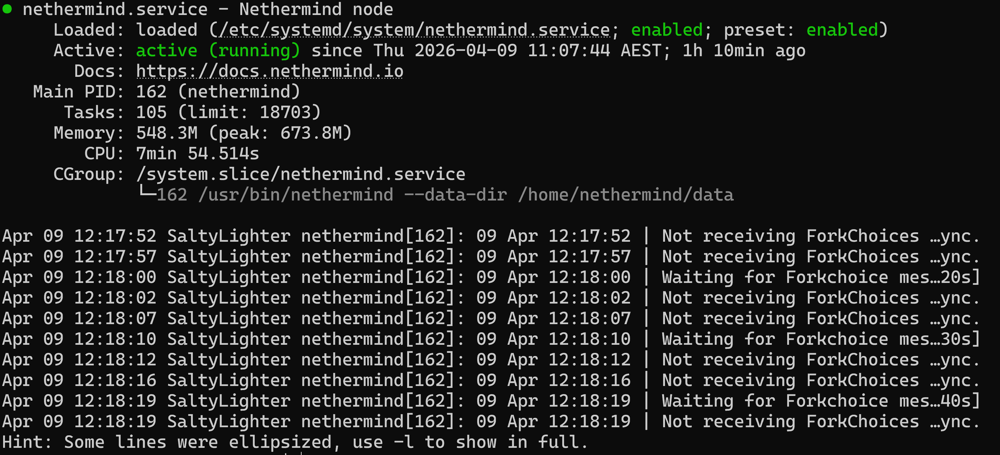
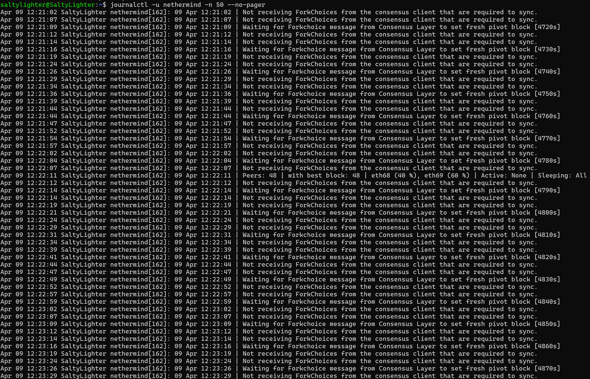
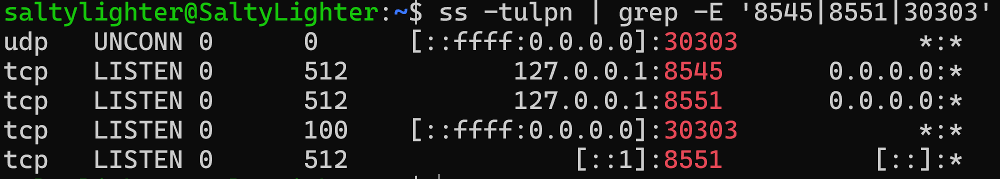
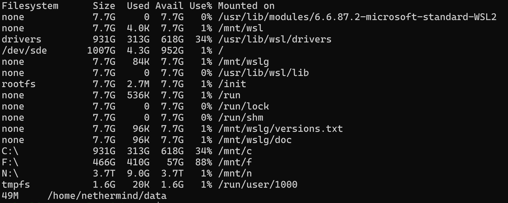

# Nethermind Install and Service Setup on WSL Ubuntu

This file documents the commands used to install the Nethermind execution client on Ubuntu running under WSL2, configure it as a `systemd` service, and verify that it was running correctly.

---

## Environment

- Host OS: Windows 11 Pro
- Linux environment: Ubuntu on WSL2
- Service manager: `systemd`
- Execution client: Nethermind
- Data directory: `/home/nethermind/data`

---

## 1. Update Ubuntu

    sudo apt update && sudo apt upgrade -y

Refresh package lists and install available updates.

---

## 2. Install base tools

    sudo apt install -y curl wget git jq unzip htop net-tools lsof build-essential software-properties-common ca-certificates

Install common tools for downloads, package management, process inspection, networking, and troubleshooting.

---

## 3. Confirm `systemd` is running

    ps -p 1 -o comm=

Expected output:

    systemd

This confirms that `systemd` is running as PID 1.

---

## 4. Add the Nethermind PPA and install Nethermind

    sudo add-apt-repository ppa:nethermindeth/nethermind -y
    sudo apt update
    sudo apt install -y nethermind

---

## 5. Verify Nethermind installation

    which nethermind
    nethermind --version
    nethermind --help | head -n 20

This confirms the binary is installed and available in the system path.

---

## 6. Create a dedicated service user

    sudo useradd -m -s /bin/bash nethermind
    sudo bash -c 'echo "nethermind soft nofile 100000" > /etc/security/limits.d/nethermind.conf'
    sudo bash -c 'echo "nethermind hard nofile 100000" >> /etc/security/limits.d/nethermind.conf'

This creates a dedicated Linux user for Nethermind and increases the open-file limits.

---

## 7. Create the data directory and environment file

    sudo -u nethermind mkdir -p /home/nethermind/data

    sudo -u nethermind bash -c 'cat > /home/nethermind/.env <<EOF
    NETHERMIND_CONFIG="mainnet"
    NETHERMIND_HEALTHCHECKSCONFIG_ENABLED="true"
    EOF'

This creates the service data directory and config environment file.

---

## 8. Create the `systemd` service file

    sudo tee /etc/systemd/system/nethermind.service > /dev/null <<'EOF'
    [Unit]
    Description=Nethermind node
    Documentation=https://docs.nethermind.io
    After=network.target

    [Service]
    User=nethermind
    Group=nethermind
    EnvironmentFile=/home/nethermind/.env
    WorkingDirectory=/home/nethermind
    ExecStart=/usr/bin/nethermind --data-dir /home/nethermind/data
    Restart=on-failure
    LimitNOFILE=1000000

    [Install]
    WantedBy=default.target
    EOF

This creates the `systemd` unit file for Nethermind.

---

## 9. Reload `systemd` and start the service

    sudo systemctl daemon-reload
    sudo systemctl start nethermind
    sudo systemctl enable nethermind

- `daemon-reload` tells `systemd` to re-read the service definitions
- `start` launches the service
- `enable` ensures it starts automatically

---

## 10. Check service status

    sudo systemctl status nethermind --no-pager

This confirms whether the service is loaded and running.

---

## 11. View logs

Follow live logs:

    journalctl -u nethermind -f

View recent logs without live follow:

    journalctl -u nethermind -n 50 --no-pager

---

## 12. Check process, ports, and disk usage

Process check:

    ps aux | grep nethermind

Port check:

    ss -tulpn | grep -E '8545|8551|30303'

Disk usage:

    df -h
    sudo du -sh /home/nethermind/data

These checks help confirm:
- the process is running
- required ports are listening
- the data directory is growing as expected

---

## 13. Notes

- `30303` is used for Ethereum P2P networking
- `8545` is the local JSON-RPC port
- `8551` is used for execution/consensus client communication
- At this stage, Nethermind was running as an execution client only
- Logs indicated it was waiting for forkchoice updates from a consensus client, which is expected until a consensus client is added

---

## 14. Useful service commands

    sudo systemctl start nethermind
    sudo systemctl stop nethermind
    sudo systemctl restart nethermind
    sudo systemctl status nethermind --no-pager
    journalctl -u nethermind -f
    journalctl -u nethermind -n 50 --no-pager

---

## 15. Screenshots

### Service status

### Recent logs

### Port check

### Disk and data usage

---

## 16. What I learned

- how to install Nethermind on Ubuntu with `apt`
- how to verify a binary with `--version` and `--help`
- how to create a dedicated Linux service user
- how to create and manage a `systemd` unit
- how to use `systemctl status` and `journalctl`
- how to inspect open ports with `ss`
- how to inspect data growth with `du`
- why an execution client alone waits for consensus-layer forkchoice messages

---

## 17. Outcome

At the end of this setup:
- Nethermind was installed successfully
- the service was running under `systemd`
- ports were listening as expected
- the data directory was being created and written to
- the environment was ready for the next steps: consensus client, monitoring, and automation
