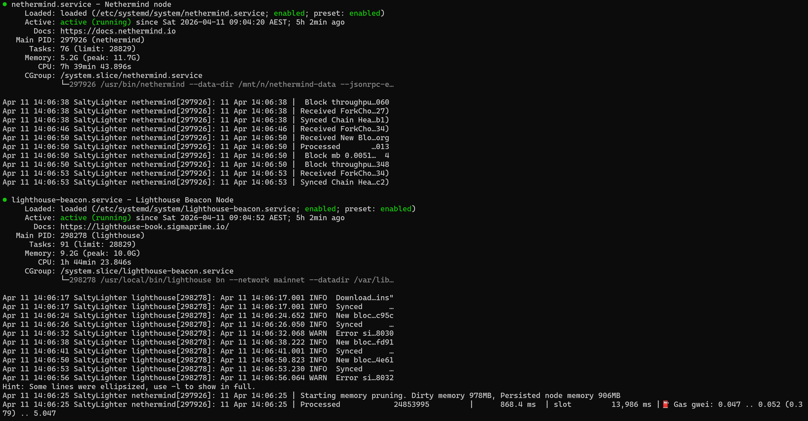

# Nethermind Storage Incident: Root Disk Filled by Duplicate Mainnet Database

This document records a storage incident in which the Linux root filesystem `/` became critically full because Nethermind was writing a full mainnet database to `/home/nethermind/data`, while the intended active database location was on the `N:` drive at `/mnt/n/nethermind-data`.

After updating the Nethermind `systemd` service to use the correct data path and removing the duplicate root-disk database, both Nethermind and Lighthouse returned to a healthy syncing state.

---

## Summary

The incident was caused by a mismatch between the intended Nethermind data location and the actual `systemd` service configuration.

Although the node was expected to use the larger `N:` drive mounted at `/mnt/n`, Nethermind was still configured to write to the Linux root filesystem. This resulted in a duplicate mainnet database under `/home/nethermind/data`, which eventually filled `/` and destabilized the node.

Once the incorrect data path was identified, the service was updated to point to `/mnt/n/nethermind-data`, the duplicate root-disk database was removed, and the stack recovered cleanly.

---

## Environment

- **Execution client:** Nethermind
- **Consensus client:** Lighthouse
- **Platform:** Ubuntu on WSL2
- **Monitoring:** Prometheus + Grafana
- **Large storage target:** `N:` mounted at `/mnt/n`

---

## Problem

The node became unstable after syncing overnight.

### Symptoms observed

- `nethermind.service` was failing and repeatedly restarting
- `lighthouse-beacon.service` was not remaining in a steady healthy state
- Lighthouse showed execution engine connection issues
- Nethermind had a very high restart counter
- the root filesystem `/` was nearly full

At that point, the issue initially appeared to be a service-health problem, but the underlying cause turned out to be storage exhaustion.

---

## Initial Checks

The first step was to inspect service state, logs, and host resources.

### Commands used

    systemctl status lighthouse-beacon nethermind --no-pager
    journalctl -u lighthouse-beacon -n 20 --no-pager
    journalctl -u nethermind -n 20 --no-pager
    uptime
    free -h
    df -h

### Key finding

The critical clue came from disk usage:

    /dev/sdd  1007G  942G   14G  99%  /

This strongly suggested that the root cause was disk exhaustion rather than CPU or memory pressure.

---

## Investigation

To identify what was consuming space, disk usage was inspected at the filesystem and directory level.

### Filesystem inspection

    sudo du -xh / --max-depth=1 2>/dev/null | sort -h
    sudo du -xh /home /var --max-depth=2 2>/dev/null | sort -h

This showed that the dominant consumer was:

    /home/nethermind/data = 930G

A deeper inspection was then run:

    sudo du -xh /home/nethermind/data --max-depth=2 2>/dev/null | sort -h | tail -n 30

This confirmed that the major storage consumer was:

    /home/nethermind/data/nethermind_db/mainnet = 930G

At that point, the source of the pressure was clear: the Linux root filesystem was being filled by the Nethermind mainnet database.

---

## Why This Was Unexpected

The intended storage location for Nethermind was the much larger `N:` drive. To verify what Nethermind was actually using, the active `systemd` service definition was inspected.

### Commands used

    systemctl cat nethermind
    sudo systemctl show nethermind -p FragmentPath -p ExecStart

The service configuration still contained:

    --data-dir /home/nethermind/data

So although `N:` had plenty of available space, Nethermind was in fact writing to the Linux root filesystem.

---

## Additional Discovery: Duplicate Database

The intended `N:` path was also checked:

    sudo du -xh /mnt/n/nethermind-data --max-depth=2 2>/dev/null | sort -h | tail -n 30

This revealed that another full Nethermind database already existed there:

    /mnt/n/nethermind-data/nethermind_db/mainnet = 931G

At that point it became clear that there were effectively **two full Nethermind mainnet databases**:

### Wrong path on root disk
- `/home/nethermind/data/nethermind_db/mainnet`

### Intended path on `N:`
- `/mnt/n/nethermind-data/nethermind_db/mainnet`

The duplicate copy on the Linux root filesystem was the one causing the outage.

---

## Root Cause

The incident was caused by a duplicate Nethermind mainnet database on the Linux root filesystem combined with a `systemd` service still pointing to the wrong data directory.

### Root cause statement

- Nethermind was configured to use `/home/nethermind/data`
- another valid large database already existed at `/mnt/n/nethermind-data`
- the duplicate root-disk database filled `/`
- Nethermind became unstable and entered a restart loop
- Lighthouse was affected because its execution client dependency was unhealthy

This was fundamentally a storage-path configuration problem that surfaced as a service availability incident.

---

## Fix

### 1. Update the Nethermind service to use the `N:` drive

The `systemd` service was edited so that `ExecStart` used the intended data directory:

    ExecStart=/usr/bin/nethermind --data-dir /mnt/n/nethermind-data --jsonrpc-enabled true --jsonrpc-enginehost 127.0.0.1 --jsonrpc-engineport 8551 --jsonrpc-jwtsecretfile /secrets/jwt.hex

After editing the service file:

    sudo systemctl daemon-reload

The active service definition was then verified:

    sudo systemctl show nethermind -p FragmentPath -p ExecStart

### 2. Confirm the `N:` target path was writable

Practical write access for the Nethermind user was confirmed with:

    sudo -u nethermind touch /mnt/n/nethermind-data/.write_test && echo writable || echo NOT_writable

This confirmed that the configured target path was actually usable by the service.

### 3. Stop both clients

To avoid further writes during cleanup, both services were stopped:

    sudo systemctl stop lighthouse-beacon
    sudo systemctl stop nethermind

### 4. Remove the duplicate root-disk database

The duplicate database under the Linux root filesystem was removed:

    sudo rm -rf /home/nethermind/data/nethermind_db

This immediately released the root filesystem pressure.

### 5. Restart Nethermind and Lighthouse

Once the configuration and storage cleanup were complete, both clients were started again:

    sudo systemctl start nethermind
    sudo systemctl start lighthouse-beacon

---

## Verification

### Disk verification

After cleanup, the Linux root filesystem returned to a healthy state:

    /dev/sdd  1007G   12G  944G   2%  /

The active `N:` drive still had substantial free space available:

    N:\  3.7T  2.0T  1.8T  53%  /mnt/n

### Service verification

Nethermind was confirmed to be running from the correct `N:`-backed path.

Healthy post-fix indicators included:

- Nethermind receiving `ForkChoice`
- Nethermind processing new blocks
- Nethermind logging `Synced Chain Head to ...`
- Lighthouse showing `Synced`
- Lighthouse peer count rising into the 70s
- Lighthouse execution hashes being marked as `verified`

These checks confirmed that both execution and consensus had returned to normal operation.

---

## Commands Used During Troubleshooting

### Service and log checks

    systemctl status lighthouse-beacon nethermind --no-pager
    journalctl -u lighthouse-beacon -n 20 --no-pager
    journalctl -u nethermind -n 20 --no-pager

### System resource checks

    uptime
    free -h
    df -h

### Disk usage investigation

    sudo du -xh / --max-depth=1 2>/dev/null | sort -h
    sudo du -xh /home /var --max-depth=2 2>/dev/null | sort -h
    sudo du -xh /home/nethermind/data --max-depth=2 2>/dev/null | sort -h | tail -n 30
    sudo du -xh /mnt/n/nethermind-data --max-depth=2 2>/dev/null | sort -h | tail -n 30

### Service configuration checks

    systemctl cat nethermind
    sudo systemctl show nethermind -p FragmentPath -p ExecStart

### Storage structure inspection

    tree -L 3 /mnt/n/nethermind-data

---

## What I Learned

This incident reinforced several practical storage and troubleshooting lessons:

- `df -h` shows **how full a filesystem is**
- `du -sh` and `du -xh` show **which directories are consuming space**
- parent directories can show similar large sizes because they include child directory contents
- mounted storage is only useful if the service is actually configured to write there
- WSL-mounted Windows drives can behave differently with ownership and metadata, so write testing is useful to confirm real service usability
- service instability is not always caused by CPU or memory pressure; disk exhaustion can be the real failure point
- checking the active `systemd` service definition is critical when actual behaviour does not match intended design

### Practical troubleshooting flow reinforced by this incident

1. check service status
2. check logs
3. check system health
4. identify the pressure point
5. trace the exact path consuming resources
6. fix the configuration
7. verify recovery

---

## Outcome

The incident was resolved successfully.

### Final state

- root disk pressure was removed
- Nethermind now runs from `/mnt/n/nethermind-data`
- the duplicate root-disk database was removed
- Lighthouse and Nethermind both returned to healthy syncing
- the node resumed normal execution-consensus coordination

This restored the stack to a stable operational state and aligned the service configuration with the intended storage design.

---

## Next Improvements

To reduce the chance of a similar incident in future:

- add a Grafana panel or alert for root disk usage
- add a written morning node health-check runbook
- document the expected Nethermind data path clearly in setup notes
- include data-path verification in future service validation steps
- continue expanding Nethermind-specific metrics and observability coverage
